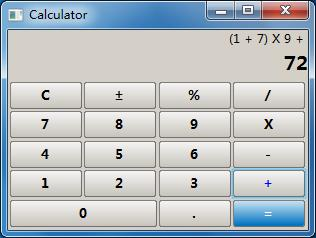

Introduction to Nana
====================

**Nana C++ Library** takes aim at easy-to-use and portable library, it provides
a GUI framework and threads for easy programming with modern C++ methods, such
as traits, metaprogramming and other template technologies.

Features
--------

* make GUI code easy to read/write/understand
* No need to #include<windows.h> such platform specified header
* flexible/easy to implement custom widget
* Bidirectional Languages supported
* Thread-safe
* cross-platform (windows, linux) *a mac version will follow*

Two Editions
------------

Now, Nana comes in two edtions: **Nana.C++03** and **Nana.C++11**

Compiler Requirments:
    * Nana.C++03: GCC(MinGW) 3.4/Visual C++7.1, 8, 9 and 10
    * Nana.C++11: GCC(MinGW) 4.7/Visual C++ 2012 RC

Gallery
-------

Widgets Demo on Windows
^^^^^^^^^^^^^^^^^^^^^^^

.. image:: ../_static/images/widget_demo_win.jpg
    :align: center

Widgets Demo on Linux (Fedora17)
^^^^^^^^^^^^^^^^^^^^^^^^^^^^^^^^

.. image:: ../_static/images/widget_demo_linux.jpg
    :align: center

Calculator Demo on Windows
^^^^^^^^^^^^^^^^^^^^^^^^^^

